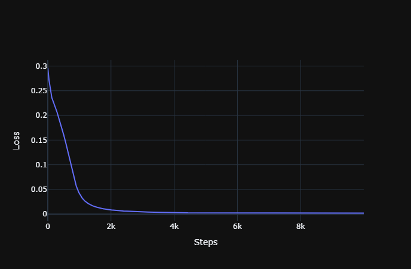

# XOR gate neural network
This is a mini side toy project which basically uses a neural network for XOR gate output prediction

## The Flow of Network

2 inputs -> 2 hidden neurons -> 1 output neuron

## Loss Curve

## Predictions vs Ground Truth

Predictions-                                      

| x1 | x2 | y |                   
| :---: | :---: | :---: |         
| 0 | 0 | 0.04 |          
| 0 | 1 | 0.94 |                 
| 1 | 0 | 0.94 |          
| 1 | 1 | 0.03 |        

Truth- 

| x1 | x2 | y |
| :---: | :---: | :---: |
| 0 | 0 | 0 |
| 0 | 1 | 1 |
| 1 | 0 | 1 |
| 1 | 1 | 0 |